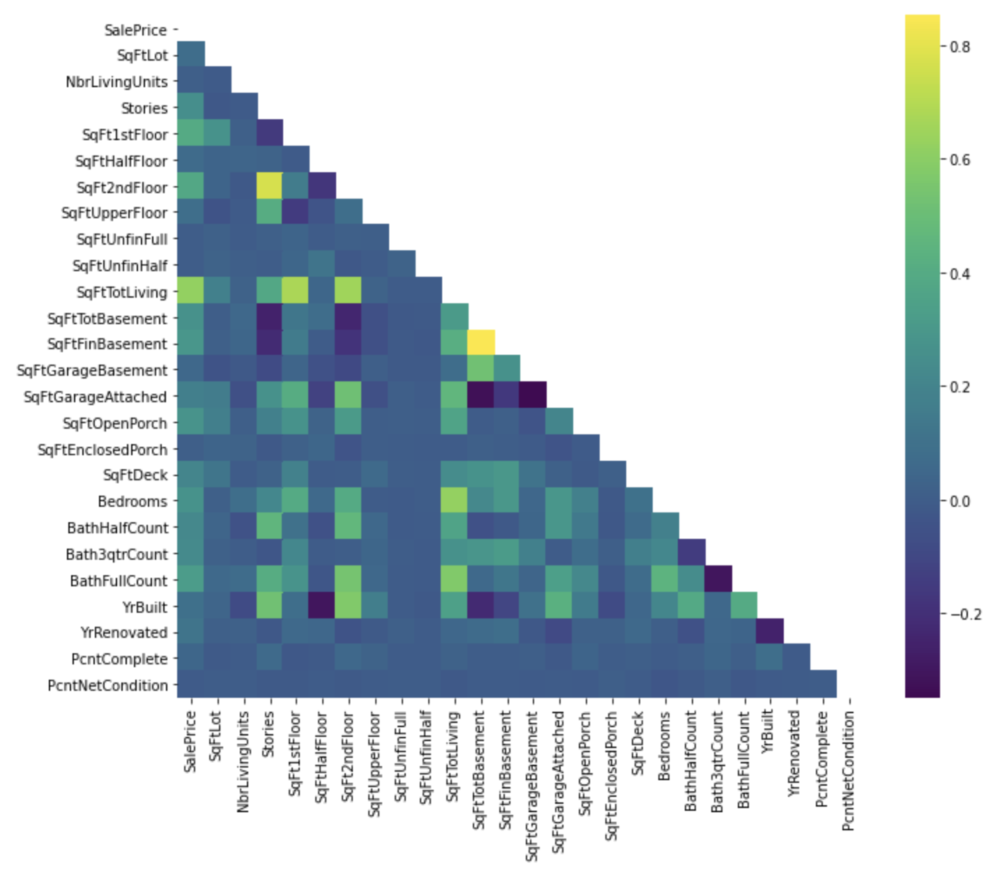
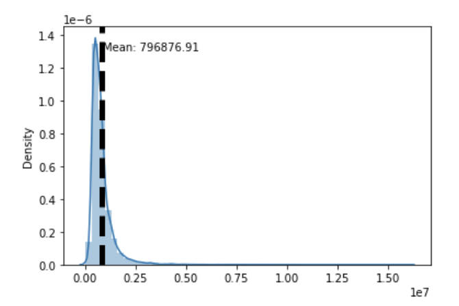
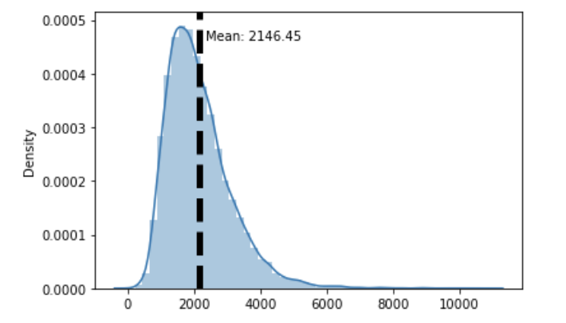

# King County Home Price Analysis

This repository offers an analysis of factors that influence housing prices in King County, WA

## This Repository

### Repository Directory

```
├── README.md        <-- Main README file explaining the project's business case,
│                        methodology, and findings
│
├── data             <-- Data in CSV format
│   ├── processed    <-- Processed (combined, cleaned) data used for modeling
│   └── raw          <-- Original (immutable) data dump
│
├── notebooks        <-- Jupyter Notebooks for exploration and presentation
│
├── references       <-- Data dictionaries, manuals, and project instructions
│
└── reports          <-- Generated analysis (including presentation.pdf)
    └── figures      <-- Generated graphics and figures to be used in reporting
```

### Quick Links

1. [Final Analysis Notebook](notebooks/stats.ipynb)
2. [Presentation Slides](reports/King County House Valuation.pdf)

### Setup Instructions

1. Go into king-county repository.
- `cd ../../king-county`
2. Create your environment by running the following code:
- `conda env create --file project.yml`
3. Acvitvate your already created environment
- `conda activate project`


## Business Understanding

Based on the findings of our [notebook](notebooks/stats.ipynb), it is recommneded for homeowners to do projects that increase their total livigin space, as in doing so, it would substantially increase their home valuation. Using historical data on the Sales Price of different homes, it was found that the more the total living space of a home, the more the Sale would increase.

## Data Understanding

### Visualization 1


A heatmap was used to visualy identify positively correlated features that had an impact on `SalePrice`.

## Visualization 2


After choosing the most positively correlated feeatures we could see, a scatterplot corrlation plot was called to identify which features seemed to have a sense of linearity. Five features, aside from the target, were chosen for this correlation matrix.

## Visualization 3


We looked at the distribution of the target variable and we saw some sense of normality. We defintely saw strong postive skew as the right tail was longer than the right tail.

## Visualization 4


We loked at the distribution of ultimately the center of our recommendation. The total living space in feet had for the most part a normal distribution with a positive skew to the right. The right tail seemed slightly longer.


## Data Preparation

In order to prepare our data, we chose to only keep data that pertained to residential homes, since we were looking at targetting the increase in value for homeowners. Therefore we filtered our data to homes for single families. We also kept a handful of continuous data columns that seemed like it would have a correlation with the `SalePrice`

## Modeling

The final model includes features `SqFtTotLiving` and engineered feature `sqfeet_feature`. 

## Evaluation

We started of with a baseline model where the only input feature was SqFtTotLiving to see how it affected the SalePrice. This model had an R-squared of 0.38. The model violated the lineary assumtion since it had a p value of 0.052. The normality p-value was 0 therefore did not violate the normality assumptions.

The final model had 2 features, one which was engineered which was SqFtTotLiving and sqfeet_feature. It had an R-Squared of 0.42 which was a slight increase over the the previous model. The model was inline with the Linearity assumption. Although it had a high JB value its p-value was 0 and therefore inline with the normality assumption. The homoscedasticity was low and therefore violated the homoscedasticity assumption. For the most part the homoscedasticity showed the model underestimating some of the SalePrice.

Because only 3 features that were used explained 42% of the data, it indicated that although it did have some exaplanatory power, it clearly required more analysis to understand what other factors had more inpact on the model.

While investigating SalePrice and the features that played a factor on its variability, we investigated SqFt1stFloor. We found that SqFt1stFloor had a positive correlation with SalePrice. For each increase of 1 in SqFt1stFloor, the SalePrice increased by 707.94.

When looking at SqFt1stFloor in the simple model we found that SqFt1stFloor had a positive correlation on SalePrice. For each increase of 1 in SqFt1stFloor, the SalePrice increased by 474.5492

## Conclusion

Based on the findings throughout the project, and the inferences made in the summary, the most logical conclusion is to recommend to have house projects that increase the SqFtTotLiving and SqFt1stFloor. However, it is important to note that the Total Living Space in feet and the Square feet of the 1st Floor is correlated, and relates to each other.

Therefore, overall, adding living space to a house should substantially increase the valuation of the house based on historical SalePrice.
